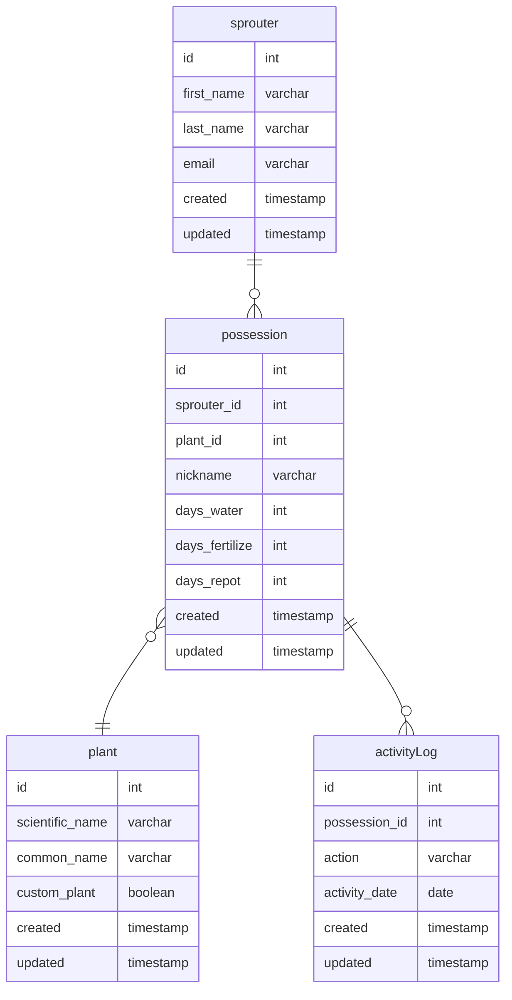

# Sprout

## app functionality
* add new plant instance to track
    * required fields
        * plant species
    * optional
        * plant nickname
        * days between waterings
        * days between fertilizations
        * days for re-potting
* edit plant instance
    * change nickname
    * change plant species
* log actions for plant
    * default date should be current, but should have functionality to choose the day
* view possessions
    * see all plants that are owned by the user, along with the previous activity logs
    * when clicking on a possession, you should be able to see the defaults for the posession,
        including the nickname/frequency of required activity.
* dashboard to show the health of plant caretaking
    * watering
    * fertilization
    * re-potting

## where to find plant species?
* https://plants.usda.gov/csvdownload?plantLst=plantCompleteList
* contains all plants found in the US


## schema


## potential queries
```sql
-- see most recent activity for each plant
with
recent as (
    select
        posession_id,
        max(case when action = 'watered' then activity_date else null end) as last_watered,
        max(case when action = 'fertilized' then activity_date else null end) as last_fertilized,
        max(case when action = 'repotted' then activity else null end) as last_repotted
    from activityLog
    group by posession_id
)

select
    ps.id,
    ifnull(ps.nickname, p.scientfic_name) as plant_name,
    r.last_watered,
    r.last_fertilized,
    r.last_repotted
from sprouter u
join posession ps
    on u.id = ps.sprouter_id
join plant p
    on p.id = ps.plant_id
join recent r
    on ps.id = r.possesion_id
where
    u.id = {user_id}
```