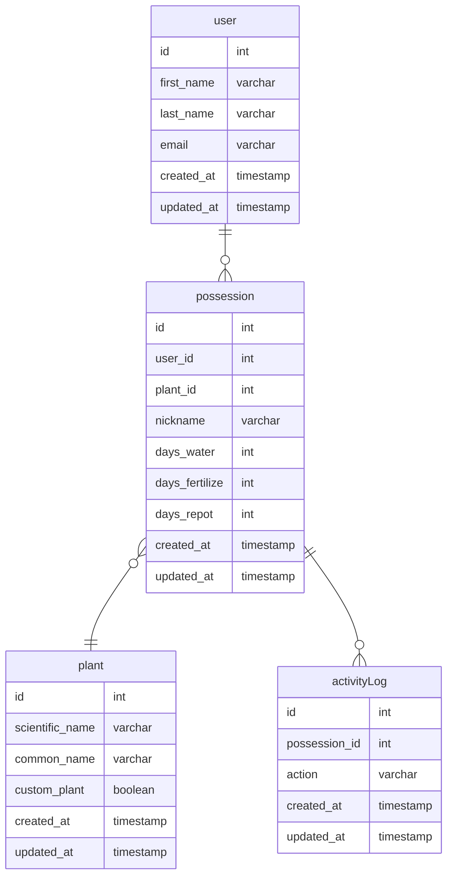

# Sprout

## app functionality
* add new plant instance to track
    * required fields
        * plant species
    * optional
        * plant nickname
        * days between waterings
        * days between fertilizations
        * days for re-potting
* edit plant instance
    * change nickname
    * change plant species
* log actions for plant
    * default date should be current, but should have functionality to choose the day
* dashboard to show the health of plant caretaking
    * watering
    * fertilization
    * re-potting

## where to find plant species?
* https://plants.usda.gov/csvdownload?plantLst=plantCompleteList
* contains all plants found in the US

